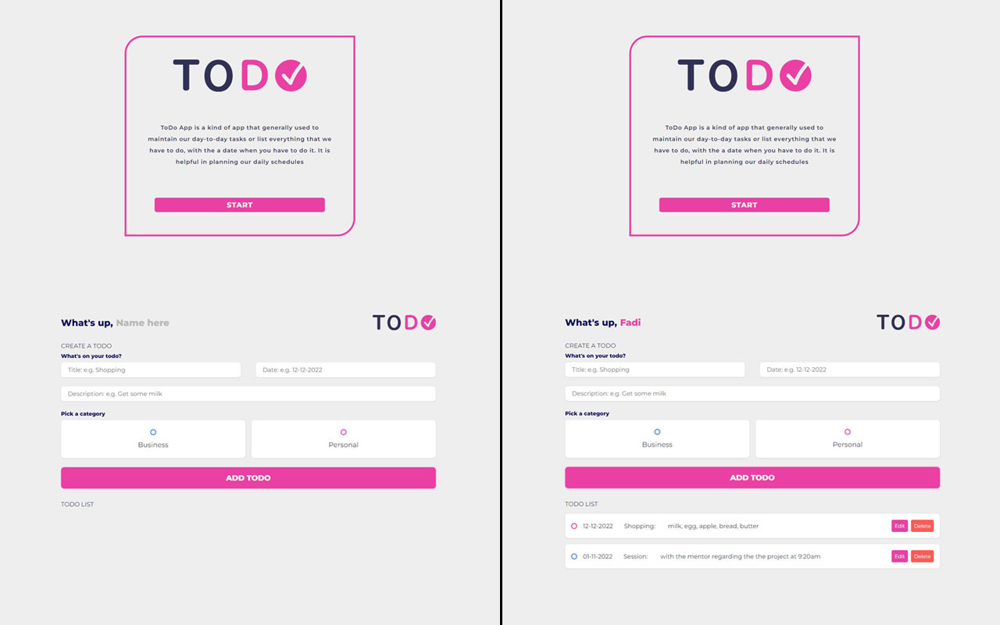

# ToDo app

## 1. Description

This app help you organizing your work schedule.</br>

1- Register your name.</br>
2- What are you going to do.</br>
3- when you have to do it.</br>
4- short description about what you should do.</br>
5- Store your todo by category.</br>
6- Able to use check mark when you start it.</br>
7- You delete todo row or edit it.

## 2. Link and Preview


Project link is available at [ToDo App](https://fadi-todo-app.netlify.app/)
The colors are inspired from master and visa card.

## 3. App Folder Structure

```text
public
└── style.css
└── Image
  └── Todo-logo-1.png
└── app-screen.jpg
src
└── pages
  └── togo-page.js
  └── welcome-page.js
└── views
  └── todo-view.js
  └── welcome-view.js
└── app.js
└── constants.js
index.html
README.md
```

## The app must have

- [x] Todo logo.
- [x] User can add his name.
- [x] User can adding a new todo entity to his list.
- [x] User can edit and delete todo row from his list.
- [x] User can mark the row as pending.
- [x] User can store his todo entity as Business or Personal
- [x] User todo list should not disappear when he refresh the page.
